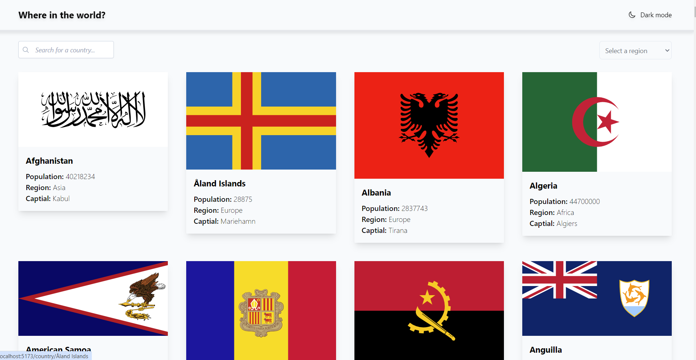
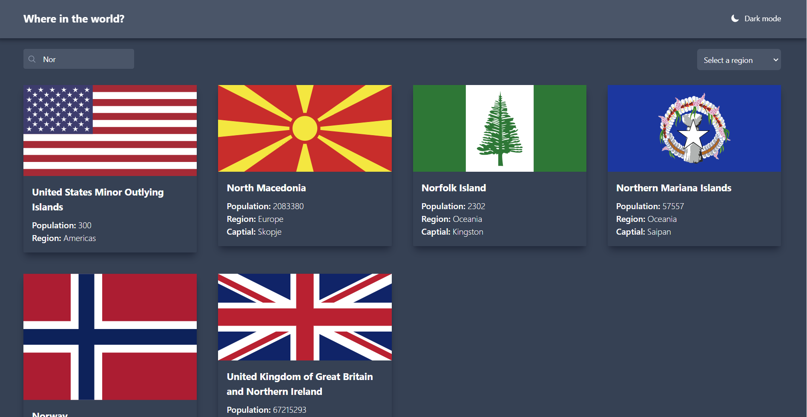
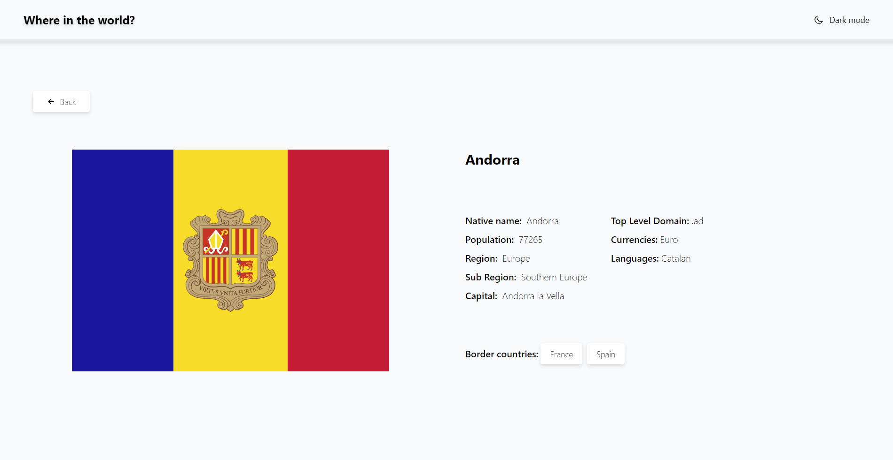
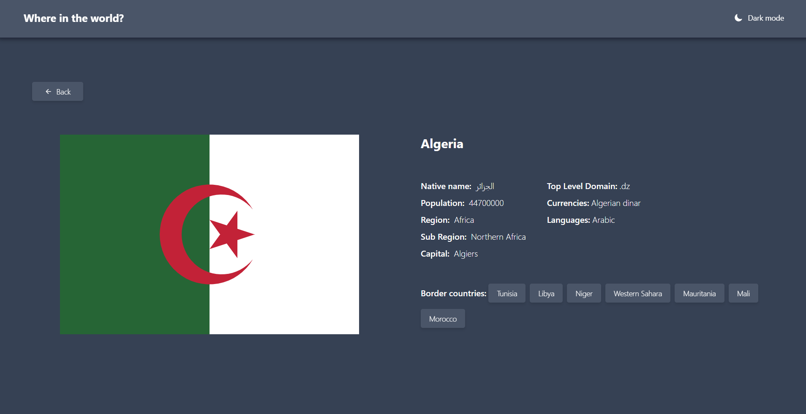
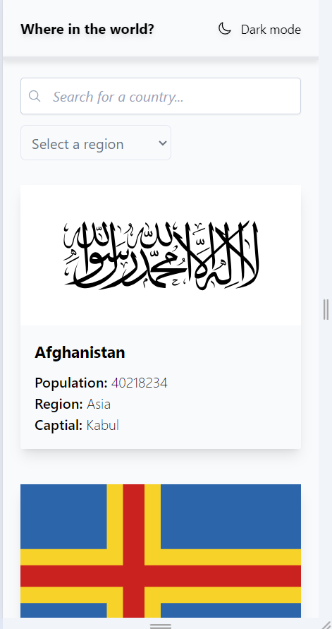
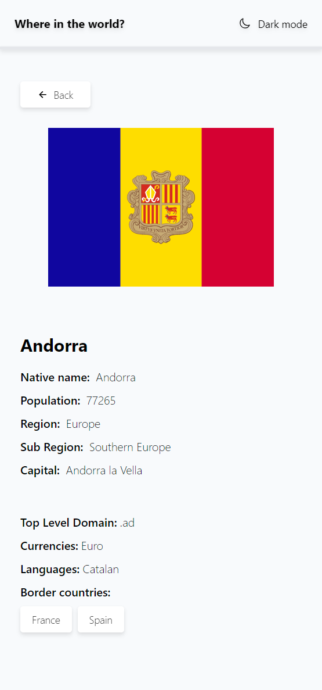

# REST Countries API with color theme switcher

This is a solution to the [REST Countries API with color theme switcher challenge on Frontend Mentor](https://www.frontendmentor.io/challenges/rest-countries-api-with-color-theme-switcher-5cacc469fec04111f7b848ca).

## Table of contents

- [Overview](#overview)
  - [The challenge](#the-challenge)
  - [Screenshot](#screenshot)
  - [Links](#links)
- [My process](#my-process)
  - [Built with](#built-with)
  - [What I learned](#what-i-learned)
- [Author](#author)

## Overview

### The challenge

Users is be able to:

- See all countries from the API on the homepage
- Search for a country using an `input` field
- Filter countries by region
- Click on a country to see more detailed information on a separate page
- Click through to the border countries on the detail page
- Toggle the color scheme between light and dark mode

### Screenshot

##### Desktop

##### Mobile

### Links

- Solution URL: [https://atripunoska.github.io/country-switcher/](https://atripunoska.github.io/country-switcher/)

## My process

### Built with

- Semantic HTML5 markup
- [Tailwind](https://tailwindcss.com/)
- [React](https://reactjs.org/)
- [React Router](https://reactrouter.com/en/main)
- [Vite](https://vitejs.dev/)

### What I learned

This was my first project where I have used Tailwind and I was able to implement the utility-first approach. The styling of the application was done without any additional custom CSS files.

Also I've used the React Router library for client side routing. I've learned how to create `<Routes>`, how to add a shared layout for different routes, how `<Outlet>` should be used in parent route elements to render their child route elements and how to use the `useParams` hook for managing the dynamic routes in the URL.

## Author

- Website - [Ana Tripunoska](https://atripunoska.github.io/)
- Frontend Mentor - [@atripunoska](https://www.frontendmentor.io/profile/atripunoska)
